<div align="center">


<a href="https://github.com/hasnain0122E">
  
</a>

<br/>

<a href="https://www.linkedin.com/in/hasnainali7867/" target="_blank"></a>
<a href="mailto:hasnain0122@gmail.com"></a>
<a href="https://wa.me/923079856242" target="_blank"></a>
<a href="https://github.com/hasnain0122E" target="_blank"></a>
<br/>


</div>

<br/>

## 🧠 About Me

```yaml
engineer:
  name: "Hasnain Ali"
  role: "AI/ML Engineer · Full Stack Developer"
  location: "Karachi, Pakistan"
  education: "B.S. Software Engineering @ Sindh Madressatul Islam University (SMIU)"
  currently_building: "Attentra — an AI infrastructure platform that routes LLM requests to cost-optimal models"
  currently_learning: ["Generative AI", "RAG Systems", "AI Agents", "Transformer internals"]
  fun_fact: "I care more about *why* a model works than just that it works."
```

- 🔭 Building **Attentra**, an intelligent LLM-routing platform (my Final Year Project)
- 🧩 Comfortable across the full AI stack — from **ANN/CNN/RNN/LSTM/GRU** fundamentals to **LLM & RAG** systems in production
- 🛠️ Also a full-stack dev — React, Next.js, FastAPI, Flutter — so I can ship the AI, not just prototype it
- 🎤 Co-Lead Organizer, **TEDxSMIU 2.0**
- 💬 Ask me about **LLM integration, deep learning architectures, or AI product strategy**

<br/>

## ⚙️ Tech Stack

<div align="center">

**AI / Machine Learning / Deep Learning**


<br/>


**Generative AI & LLMs**


**Backend & Web**


**Databases & Tools**


</div>

<br/>

## 📊 GitHub Stats

<div align="center">
  
  
</div>

<div align="center">
  
</div>

<div align="center">
  
</div>

<div align="center">
  
</div>

> These cards are generated once a day by a GitHub Action and committed straight into this repo (see `.github/workflows/update-stats.yml`), so they load instantly from GitHub itself instead of depending on a third-party server at page-load time.

<br/>

## 🚀 Featured Projects

<div align="center">

<a href="https://github.com/hasnain0122E/Attentra">

</a>
<a href="https://github.com/hasnain0122E/Curo">

</a>

<a href="https://github.com/hasnain0122E/Sentence_Completion_Project_LSTM_GRU_RNN_NLP">

</a>
<a href="https://github.com/hasnain0122E/telco-customer-churn-prediction">

</a>

</div>

### 🧭 Attentra — Intelligent LLM Routing Platform
> AI middleware that routes each request to the most cost-optimal LLM based on task complexity, quality, latency, and cost — with a full audit log of routing decisions.

`Next.js` `TypeScript` `PostgreSQL` `Prisma` `OpenAI API` `Claude API` `Gemini API`

### 🩺 Curo — AI Healthcare Mobile App
> A Flutter healthcare app that scans prescriptions & lab reports, extracts structured medical data, and answers questions via AI — bilingual (English/Urdu).

`Flutter` `Firebase` `Google ML Kit` `Gemini API` `Groq API`

### ✍️ Sentence Completion — LSTM / GRU / RNN
> A deep learning NLP model that completes half-written sentences and ranks the top-5 next-word predictions by probability. ~75% accuracy.

`Python` `TensorFlow` `Keras` `LSTM` `GRU` `NLP` `Streamlit`

### 📉 Telco Customer Churn Prediction
> An end-to-end ML pipeline predicting customer churn from behavioral and account data, with full EDA and model comparison.

`Python` `scikit-learn` `Pandas` `EDA`

<br/>

## 🌱 Learning Roadmap

```text
Machine Learning        Deep Learning              Now Building
├── Supervised          ├── ANN                     ├── Generative AI
├── Classification       ├── CNN                     ├── RAG Systems
├── Feature Engineering ├── RNN / LSTM / GRU         ├── AI Agents
└── Model Evaluation    ├── Attention Mechanism      ├── LLM Routing (Attentra)
                        └── Transformers             └── Production AI Automation
```

<br/>

<div align="center">

### 📫 Let's connect and build something intelligent together

<a href="https://www.linkedin.com/in/hasnainali7867/" target="_blank"></a>
<a href="mailto:hasnain0122@gmail.com"></a>
<a href="https://wa.me/923079856242" target="_blank"></a>


</div>
